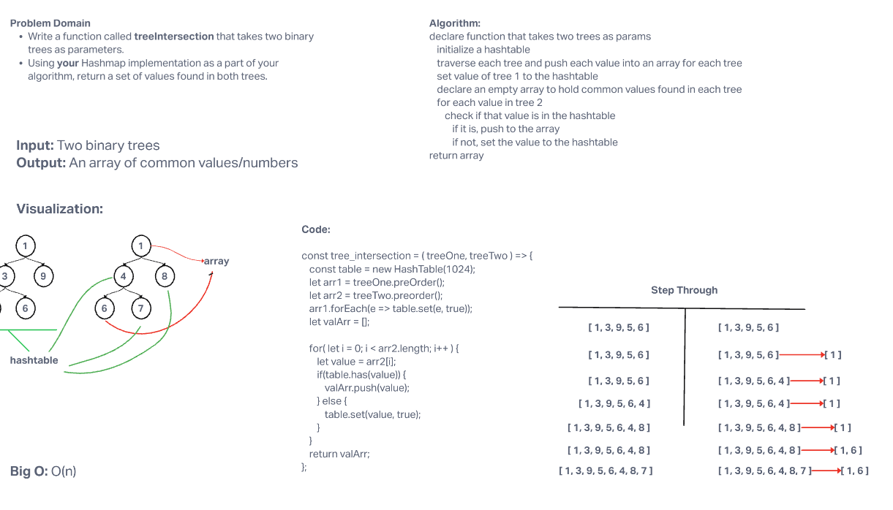

# Code Challenge - Class 32

## Project: Tree Intersection

### Author: Steve Gant

### Problem Domain  

- Write a function called `tree_intersection` that takes two binary trees as parameters.
- Using your `Hashmap` implementation as a part of your algorithm, return a set of values found in both trees.

### Setup

#### Features / Routes

- Feature One: `tree-intersection.js`

#### Tests

- How do you run tests?
`npm test tree-intersection.test`

#### UML
